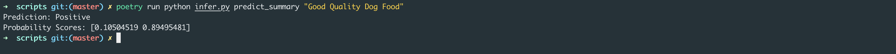
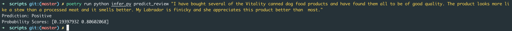

# Customer Sentiment Analysis
## Problem Description
> "Create a model that predicts scores from text reviews"

### Business Case
The web contains enormous amounts of user generated data. One huge source of such information can be found in the myriads of customer written complaints and reviews.
The aim of this data challenge is to show that it is possible to extract useful insights from text and that there is value in text data. Can you convince the C-suite of an online food seller company that there is value in working with the text data? In a first meeting you want to show them, that a machine learning model can be used to distinguish between different levels of consumer satisfaction

### The situation (detailed)
The food retailer wants to understand their users as well as users' feelings about the products they are selling.
How could a model as described above help in this situation? Make assumptions or educated guesses if some details are missing that you would like to use for your argument.

## Data
### Predictive Fields
...

### Target Field
...

## Preprocessing
* Lower Casing
* Remove Punctuations
* Stopwords Removal
* Remove Frequent Words
* Remove Rare Words
* Lemmatization
* Remove URLs
* Scores to Class conversion

## Training
...

## Evaluation
To run inference on your data you can use either the cli or the web application.
### CLI
1. Install necessary packages (Refer [Getting Started](https://github.com/adimyth/customer_sentiment_analysis#getting-started) below).
2. Navigate to scripts directory
3. To predict sentiment given summary -
```bash
poetry run python infer.py predict_summary "{summary_text}"
```


4. To predict sentiment given review text -
```bash
poetry run python infer.py predict_review "{review_text}"
```


## Baselines
### Random Baseline
Randomly predict a class. Since, it's a binary classification -
```python
Accuracy = 50%
```

### Most Frequent Class
Predict the most frequent class all times. Since, `positive` class is the frequent class. Baseline accuracy -
```
Accuracy = # positive samples / # total samples
Accuracy = 307811/395003 ~ 0.78
```

## Machine Learning Models
Train different ML models on the summary & text vectors. We are using `TfIdfVectorizer` & `CountVectorizer` to convert text & summary into corresponding vectors. Here, we compare the following models -
* Multinomial Naive Bayes
* NBSVM
* Logisitic Regression

### Count Vectorizer
#### Summary
|                                  |      ACC |      MCC |     TP |    TN |    FP |    FN |
|:---------------------------------|---------:|---------:|-------:|------:|------:|------:|
| ('naive_bayes', 'Train')         | 0.874195 | 0.607792 | 234326 | 41346 | 28007 | 11665 |
| ('naive_bayes', 'Valid')         | 0.859239 | 0.556196 |  58275 |  9464 |  7874 |  3223 |
| ('nbsvm', 'Train')               | 0.780072 | 0        | 245991 |     0 | 69353 |     0 |
| ('nbsvm', 'Valid')               | 0.780075 | 0        |  61498 |     0 | 17338 |     0 |
| ('logistic_regression', 'Train') | 0.878197 | 0.616823 | 237074 | 39860 | 29493 |  8917 |
| ('logistic_regression', 'Valid') | 0.867155 | 0.579536 |  58883 |  9480 |  7858 |  2615 |

#### Text
|                                  |      ACC |      MCC |     TP |    TN |    FP |    FN |
|:---------------------------------|---------:|---------:|-------:|------:|------:|------:|
| ('naive_bayes', 'Train')         | 0.887996 | 0.665164 | 231461 | 49041 | 20687 | 14693 |
| ('naive_bayes', 'Valid')         | 0.870953 | 0.607217 |  57711 | 11069 |  6363 |  3828 |
| ('nbsvm', 'Train')               | 0.779259 | 0        | 246154 |     0 | 69728 |     0 |
| ('nbsvm', 'Valid')               | 0.779261 | 0        |  61539 |     0 | 17432 |     0 |
| ('logistic_regression', 'Train') | 0.908434 | 0.721914 | 237293 | 49665 | 20063 |  8861 |
| ('logistic_regression', 'Valid') | 0.884451 | 0.646691 |  58461 | 11385 |  6047 |  3078 |


### TFIDF Vectorizer
#### Summary
|                                  |      ACC |      MCC |     TP |    TN |    FP |   FN |
|:---------------------------------|---------:|---------:|-------:|------:|------:|-----:|
| ('naive_bayes', 'Train')         | 0.868128 | 0.576811 | 240831 | 32928 | 36425 | 5160 |
| ('naive_bayes', 'Valid')         | 0.855941 | 0.530696 |  60004 |  7475 |  9863 | 1494 |
| ('nbsvm', 'Train')               | 0.780072 | 0        | 245991 |     0 | 69353 |    0 |
| ('nbsvm', 'Valid')               | 0.780075 | 0        |  61498 |     0 | 17338 |    0 |
| ('logistic_regression', 'Train') | 0.874819 | 0.603768 | 237700 | 38169 | 31184 | 8291 |
| ('logistic_regression', 'Valid') | 0.867281 | 0.578148 |  59120 |  9253 |  8085 | 2378 |

#### Text
|                                  |      ACC |      MCC |     TP |    TN |    FP |   FN |
|:---------------------------------|---------:|---------:|-------:|------:|------:|-----:|
| ('naive_bayes', 'Train')         | 0.799881 | 0.270204 | 245906 |  6762 | 62966 |  248 |
| ('naive_bayes', 'Valid')         | 0.792126 | 0.212019 |  61489 |  1066 | 16366 |   50 |
| ('nbsvm', 'Train')               | 0.779259 | 0        | 246154 |     0 | 69728 |    0 |
| ('nbsvm', 'Valid')               | 0.779261 | 0        |  61539 |     0 | 17432 |    0 |
| ('logistic_regression', 'Train') | 0.899608 | 0.6926   | 237068 | 47102 | 22626 | 9086 |
| ('logistic_regression', 'Valid') | 0.88944  | 0.660337 |  58893 | 11347 |  6085 | 2646 |

## Getting Started
All the experiments are run on `python 3.7.0`.

1. Clone the repository
2. If you do not have python3.7 installed. Run the below steps for easy installation using [asdf](https://asdf-vm.com/). *asdf* allows us to manage multiple runtime versions such for different languages such as `nvm`, `rbenv`, `pyenv`, etc using a CLI tool
	* Install asdf using this [guide](https://asdf-vm.com/#/core-manage-asdf-vm?id=install)
	* Now install `python3.7.0`
	```bash
	asdf plugin add python
	asdf install python 3.7.0
	asdf local python 3.7.0
	```
	* Check the set python version
	```bash
	asdf current python
	```
3. Install poetry. [Poetry](https://python-poetry.org/docs/) is a python dependency management & packaging tool. Allows us to declare project libraries dependency & manage them
	```bash
	asdf plugin add poetry
	asdf install poetry latest
	asdf local poetry 1.1.1
	```
4. Install all dependencies
	```bash
	poetry install
	```

## Project Structure
```bash
.
├── data
│   ├── intermediate
│   ├── processed
│   └── raw
├── notebooks
├── pickles
├── poetry.lock
├── pyproject.toml
└── scripts
```